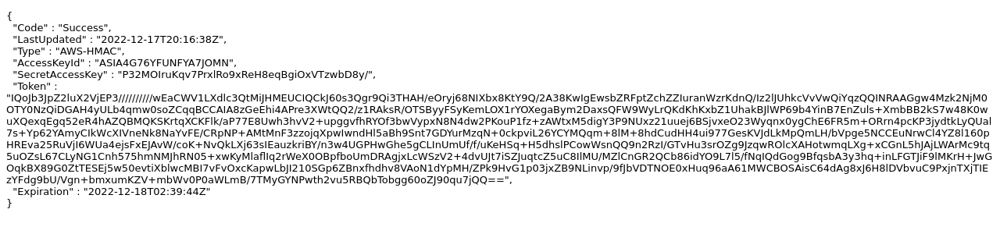
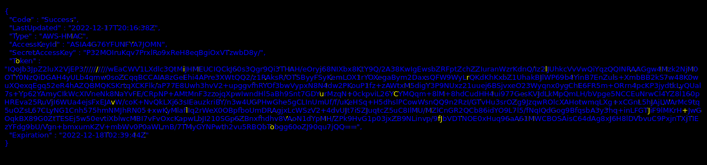

# Santa's Screenshot Render Function

*Writeup by: c16*

  * **Category**: Web Security
  * **Difficulty**: Medium
  * **Author**: Deaths Pirate

## Starting Point
The challenge starts at a web page (`https://hackvent.deathspirate.com`) with a form in which the user can enter a URL:


No other resources are provided.

## Functionality of the Web Page

When the user enters a URL and submits the form, the web server apparently performs the following steps:

* Request this URL
* Render the web page (internally)
* Convert (the upper part of) it to a bitmap image
* Store the rendered image in a web-accessible folder
* Send a web page with this image back to the user

This gives rise to an serve-side request forgery (SSRF) attack. We can obtain some more information about the server by entering, for instance, `https://www.whatismybrowser.com/` into the form with the following result:


## Analysis of the HTML Source

Before we dive deeper into the SSRF attack, we should have a glance at the HTML source. It reveals that the static images are stored on `https://hackvent2022.s3.eu-west-2.amazonaws.com`, i.e. the Amazon simple storage service (Amazon S3). We can inspect the content of the S3 bucket simply by accessing its URL:


## The 1st Half of the Flag

Bingo, one of the stored files is `flag1.txt`. We open the URL `https://hackvent2022.s3.eu-west-2.amazonaws.com/flag1.txt` to get its content:

> Congratulations! You've found .... oh no wait
> Santa told us that sometimes S3 buckets aren't so secure :/
> We've added an extra step to make sure the flag doesn't get breached, we split it in two and put the other half somewhere .... Secret ;)
> Here's the first half anyway:
> HV22{H0_h0_h0_H4v3_&_

Now, we need to find the second half. The word "Secret" appears to be a concealed hint where to look for it.


## Obtaining Security Credentials by SSRF

Some web research with keywords `aws` and `ssrf` is helpful to determine the next steps. As described in [hackingthe.cloud](https://hackingthe.cloud/aws/exploitation/ec2-metadata-ssrf/), Amazon EC2 instances have access to a quite interesting metadata service at `http://169.254.169.254`:

> On EC2 instances that have an IAM role attached the metadata service will also contain IAM credentials to authenticate as this role.

Background information on IAM roles and temporary security credentials can be found here:

* https://docs.aws.amazon.com/IAM/latest/UserGuide/id_roles.html
* https://docs.aws.amazon.com/IAM/latest/UserGuide/id_credentials_temp.html
* https://docs.aws.amazon.com/IAM/latest/UserGuide/id_roles_use_switch-role-ec2.html

Entering `http://169.254.169.254/latest/meta-data/iam/security-credentials/` into Santa's screenshot form reveals that there is an IAM role `Hackvent-SecretReader-EC2-Role`. We obtain a screenshot of the temporary security credentials by entering `http://169.254.169.254/latest/meta-data/iam/security-credentials/Hackvent-SecretReader-EC2-Role`:


Next, we need two solve the following two issues:

* Find out what we can do exactly with the security credentials to get the 2nd half of the flag.
* Obtain a text representation of the security credentials.

Therein, we have to keep in mind that the credentials are temporary. One can observe that new credentials are generated every hour.


## Converting the Credentials from the Screenshot to Text

The security credentials come as a 1280 by 300 PNG image, and we need to obtain the values for `AccessKeyId` (20 chars), `SecretAccessKey` (40 chars), and `Token` (1172 chars):



Manual typing is somewhat time-consuming and only of limited use as the credentials expire. Common off-the-shelf OCR (optical character recognition) tools produce a high amount of errors, and finding these errors is about as time-consuming as manual typing. Hence, I decided to write a custom OCR tool in Python based on OpenCV. The following subsections outline the algorithm. The source files are provided in my Github .

### Basic idea

For detecting a specific char, compute the correlation coefficient (CCoeff) between the screenshot and a template of this char. The char is detected at each location where CCoeff is above some threshold:

```Python
res = cv2.matchTemplate(imgRoi, tpl, cv2.TM_CCOEFF_NORMED)
loc = np.where(res >= threshold)
```

### Templates
* Are X by 13 pixels grayscale images cut out from sample screenshots where "X" is a variable width.
* May include whitespace to avoid that, for example, "I" is matched as a part of "D", "H" , "T".

### Threshold
* Is determined individually for each char
* A low threshold value allows to detect chars despite of variation caused by anti-aliasing and kerning as in "To"
* A high threshold value eliminates false matches caused by cross-correlations among different chars in the given font such "I" and "l" or "O" and "0".
* If a high threshold value (e.g. 0.95) is applied, several templates are needed for this char because of the anti-aliasing.

### OCR step 1: Match all templates
* Apply each template to the screenshot and store all matches with x, y, char and used template
* If two different chars are detected at the same (x, y) prefer e.g. "n" over "r"

### OCR step 2: Eliminate overlapping matches
* Sort the matches from step 1 in top-to-bottom, left-to-right order
* Discard matches with y-coordinates above or below the text lines (`y mod 15 == 0`)
* Resolve overlapping matches within a line. Applying the condition `delta x <= 2` works reasonably well.
* In case of overlapping matches, prefer "n" over "r" and "m" over "n" 
* Result: list of detected chars with x, y, char and used template
	
### OCR step 3: Generate output
* Write the detected chars into a text file
* Draw an image with all detected chars using the template image and (x, y) coordinates of each detected char
* Draw the original screenshot in a discernible color into that image at locations at which there is no match

The following image shows the output. Matched chars are shown in blue. Unmatched pixels are shown in yellow. The remaining manual work is only to enter the yellow chars into the text file at the corresponding positions.



## API Access to AWS Secrets Manager

Useful insights about using temporary security credentials for accessing AWS can be gained, for instance, from:
* https://www.dltlabs.com/blog/how-to-use-temporary-credentials-for-applications-running-on-ec2-virtual-machines-896397
* https://rizemon.github.io/posts/awshackerone-ctf/
* https://github.com/andresriancho/enumerate-iam

Now, the following hint from `flag1.txt` along with the name of the IAM role `Hackvent-SecretReader-EC2-Role` make sense:

> we split it in two and put the other half somewhere .... Secret ;)

We can guess that we have the access permission for the AWS `Secrets Manager`. The following Python sketch illustrates how to connect to the service and obtain its list of secrets using the temporary security credentials gained in the previous steps:

```Python
import boto3
from botocore.exceptions import ClientError

def create_aws_client(aws_service_name):
    return boto3.client(
        aws_service_name,
        aws_access_key_id="...",
        aws_secret_access_key="...",
        aws_session_token="...",
    )

try:
    client = create_aws_client('secretsmanager')
    result = client.list_secrets()
    print(result)

except ClientError as err:
    print(err)
```

The Secrets Manager returns the Amazon Resource Name (ARN) of the 2nd flag part:

```json
{
  "SecretList": [
    {
      "ARN": "arn:aws:secretsmanager:eu-west-2:839663496474:secret:flag2-UjomOM",
      "Name": "flag2",
      "Description": "Flag for hackvent 2022"
    }
  ]
}
```


## Getting the Second Half of the Flag

We call the API function `get_secret_value()` which returns the `SecretString` field containing a JSON structure:

```Python
arn = result['SecretList'][0]['ARN']
secret_value = client.get_secret_value(SecretId=arn)
flag2 = json.loads(secret_value['SecretString'])
```

The content of `SecretString` is the 2nd half of the flag along with additional hints:

> "flag2description": "Oh Hai! Santa made us split the flag up, he gave this part to me and told me to put it somewhere safe, I figured this was the best place.  The other half he gave to another Elf and told him the same thing, but that Elf told me he just threw it into a bucket!  That doesn't sound safe at all!"

> "flag2": "M3r2y-Xm45_Yarr222_<3_Pirate}"

> "what_is_this": "Oh I forgot to mention I overheard some of the elves talking about making tags available ... maybe they mean gift tags?! Who knows ... maybe you can make something out of that ... or not :D "


## The Flag

`HV22{H0_h0_h0_H4v3_&_M3r2y-Xm45_Yarr222_<3_Pirate}`


## Security Measures

The AWS Security Blog suggests using IMDSv2 as protection against SSRF ()

Apart from this, endowing (untrusted) clients with the control over URLs that are requested by the server imposes an inherent security risk. It should be considered to change the application design and move more of the functionality to the client side.
