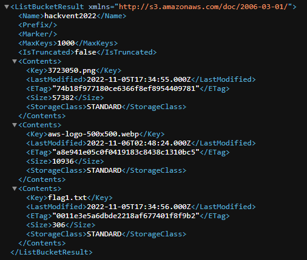
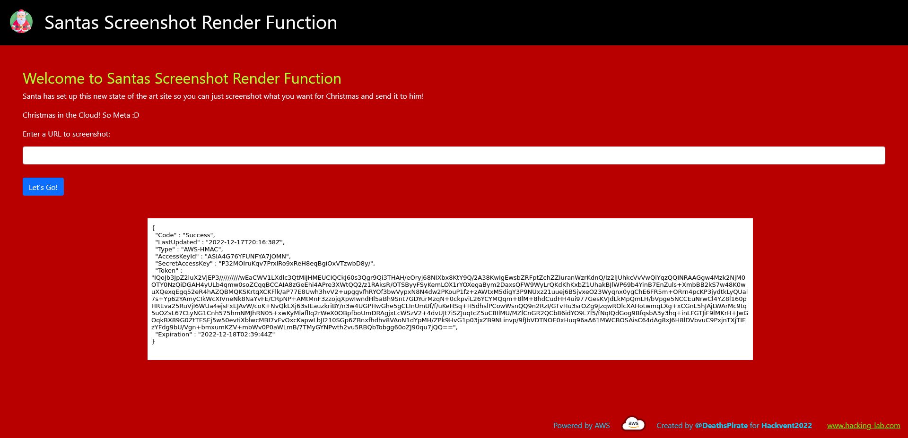

# Santa's Screenshot Render Function

*Writeup by: c16*

  * **Category**: Web Security
  * **Difficulty**: Medium
  * **Author**: Deaths Pirate

## Starting Point
The challenge starts at a web page (`https://hackvent.deathspirate.com`) with a form in which the user can enter a URL:


No other resources are provided.

## Functionality of the Web Page

When the user enters a URL and submits the form, the web server apparently performs the following steps:

* Access this URL
* Render the web page (internally)
* Convert (the upper part of) it to a bitmap image
* Store the rendered image in a web-accessible folder
* Send a web page with this image back to the user

We keep in mind that such a functionality gives rise to an SSRF (serve-side request forgery) attack. In addition, we can obtain some more information about the server by entering, for instance, `https://www.whatismybrowser.com/` into the form with the following result:


## Analysis of the HTML Source

Before we dive deeper into SSRF we should have a look at the HTML source. The source reveals that the static images are stored on `https://hackvent2022.s3.eu-west-2.amazonaws.com`, i.e. the Amazon simple storage service (Amazon S3). We can have a look at what is stored there simply by accessing that URL:



## The 1st Half of the Flag

Bingo, one of the stored files is `flag1.txt`. We open the URL `https://hackvent2022.s3.eu-west-2.amazonaws.com/flag1.txt` to get its content:

```
Congratulations! You've found .... oh no wait

Santa told us that sometimes S3 buckets aren't so secure :/

We've added an extra step to make sure the flag doesn't get breached, we split it in two and put the other half somewhere .... Secret ;)

Here's the first half anyway:

HV22{H0_h0_h0_H4v3_&_
```

Now, we need to find the second half. The word "Secret" appears to be a concealed hint where to look for it.

## Obtaining Security Credentials by SSRF

Some web research helps to determine the next steps. From what we know so far, the search can be started using keywords such as `aws` and `ssrf`. As described in [hackingthe.cloud](https://hackingthe.cloud/aws/exploitation/ec2-metadata-ssrf/), Amazon EC2 instances have access to a metadata service at `http://169.254.169.254`:

> On EC2 instances that have an IAM role attached the metadata service will also contain IAM credentials to authenticate as this role.

Background information on IAM roles and temporary security credentials can be found here:

* https://docs.aws.amazon.com/IAM/latest/UserGuide/id_roles.html
* https://docs.aws.amazon.com/IAM/latest/UserGuide/id_credentials_temp.html
* https://docs.aws.amazon.com/IAM/latest/UserGuide/id_roles_use_switch-role-ec2.html

Entering `http://169.254.169.254/latest/meta-data/iam/security-credentials/` into Santa's screenshot form reveals there is an IAM role `Hackvent-SecretReader-EC2-Role`. We obtain a screenshot of the temporary security credentials by entering `http://169.254.169.254/latest/meta-data/iam/security-credentials/Hackvent-SecretReader-EC2-Role`:



Next, we need two solve the following two issues:

* Find out what we can do exactly with the security credentials to get the 2nd half of the flag.
* Obtain a text representation of the security credentials.

Therein, we have to keep in mind that the credentials are temporary. One can observe that new credentials are generated every hour.

## API Access to Secretsmanager

Useful insights about using temporary security credentials to access AWS services can be gained, for instance, from:
* https://www.dltlabs.com/blog/how-to-use-temporary-credentials-for-applications-running-on-ec2-virtual-machines-896397
* https://rizemon.github.io/posts/awshackerone-ctf/
* https://github.com/andresriancho/enumerate-iam

Now the hint from `flag1.txt`

> we split it in two and put the other half somewhere .... Secret ;)

along with the name of the IAM role `Hackvent-SecretReader-EC2-Role` make sense. We can guess that we have the access permission for the `Secretsmanager` service. The following Python code sketch illustrates how to connect to the service and obtain its list of secrets:

```Python
import boto3
from botocore.exceptions import ClientError

def create_aws_client(aws_service_name):
    return boto3.client(
        aws_service_name,
        aws_access_key_id="`[...]`",
        aws_secret_access_key="`[...]`",
        aws_session_token="`[...]`",
    )

try:
    client = create_aws_client('secretsmanager')
    result = client.list_secrets()
    print(result)

except ClientError as err:
    print(err)
```

## The Flag

`HV22{}`

## Security Measures
