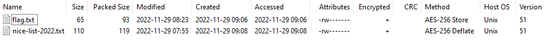

# Santa's Nice List

*Writeup by: c16*

  * **Category**: Crypto
  * **Difficulty**: Hard
  * **Author**: keep3r

## Starting Point
For this challenge, a file `nice-list.zip` is provided along with the following description:

> Santa stored this years "Nice List" in an encrypted zip archive. His mind occupied with christmas madness made him forget the password. Luckily one of the elves wrote down the SHA-1 hash of the password Santa used.

> xxxxxx69792b677e3e4c7a6d78545c205c4e5e26

> Can you help Santa access the list and make those kids happy?

## Initial Analysis of the Challenge and the ZIP File

The zip file contains two files one of which is `flag.txt`:

flag.txt is encrypted with AES-256, and no compression is applied (`AES-256 Store`).

An SHA-1 hash value has a length of 160 bits, i.e. 20 bytes or 40 hex digits.
The given SHA-1 hash consists of 34 hex digits and an unknown prefix of 6 digits.

Apparently, the missing 6 digits need to be guessed which would be well feasible using a brute force attack.
Worst case: $16^6 = 16.777.216$ different prefixes.

## Towards a Solution Concept

## Solution Using John the Ripper

## Decryption and Decompression using 7z

## The Flag

`HV22{HAVING_FUN_WITH_CHOSEN_PREFIX_PBKDF2_HMAC_COLLISIONS_nzvwuj}`

## Addendum: Alternative Solution using Python
